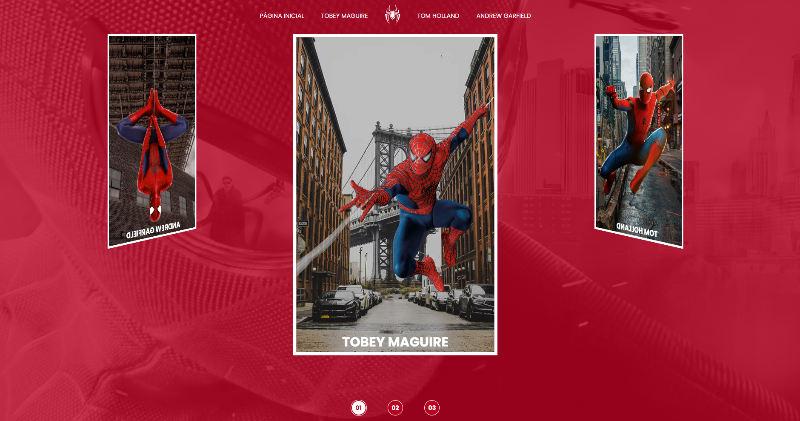

# Spider-man Project

## Projeto desenvolvido dentro do bootcamp de Front-end da DIO, onde o desafio foi aplicar os conhecimentos em html, css e javascript. No projeto podemos encontrar alguns filmes do teiudo e entender a cronologia.

# Link
[Live Site](https://allesonsales.github.io/spider-man/)
